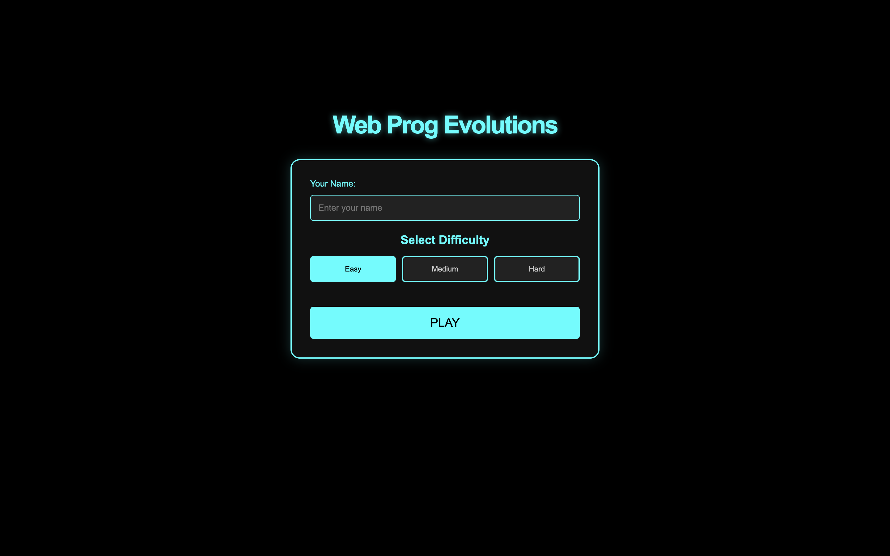
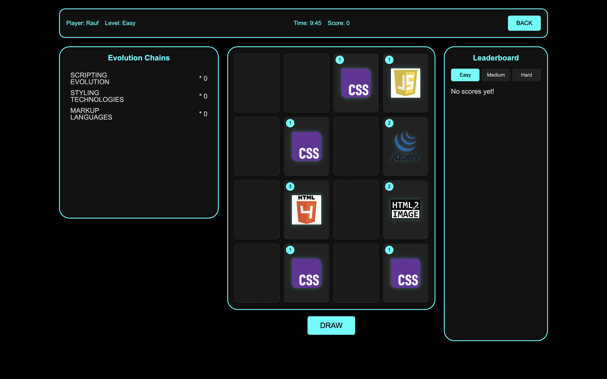

# Railway Puzzle Game


**An Educational Puzzle Game Exploring the History of Web Programming Technologies**

## 📖 Overview


**Web Prog Evolutions** is a browser-based educational puzzle game designed to help players understand the evolution of web development technologies. Through interactive gameplay and a visually engaging interface, players merge technologies from the past, present, and future across multiple evolution chains.

---

## 🕹️ Gameplay

- **Three Difficulty Levels:** Easy (4x4), Medium (6x6), Hard (8x8)
- **Time Limits:** 10, 15, and 20 minutes respectively
- **Merging Mechanic:** Combine two identical technologies to evolve them to the next level
- **Goal:** Complete all evolution chains and earn as many points as possible before time runs out

### Evolution Chain Rules

- Each chain consists of 6 levels
- Completing a full chain grants:
  - 5 points (Easy)
  - 10 points (Medium)
  - 15 points (Hard)

---

## 🎮 Game Flow

### Start Screen
- Players input their name and select a difficulty level
- Clicking **PLAY** begins the game

### Game Screen
Divided into 4 sections:
1. **Game Data**: Shows name, difficulty, score, and time left
2. **Scoring Table**: Lists all evolution chains and points earned
3. **Game Board**: The grid where merging takes place
4. **Leaderboard**: Displays top 5 scores per difficulty

### Tooltips
- Hovering over a technology for 3 seconds displays:
  - Name
  - Short description
  - Full evolution chain image

### Game End
- When time runs out, a popup displays:
  - Final score
  - Option to restart or return to the menu
  - High scores are recorded in the leaderboard if qualified

---

## 🧩 Technologies & Evolution Chains

- Stored in `evolutions.js` as a JSON structure
- Each chain includes:
  - Name, tooltip, description, difficulty level, point value
  - 6 steps, each with name, icon (`img`), and description

Example format:
```json
{
  "name": "Database Evolution",
  "tooltip": "DB.png",
  "points": 15,
  "difficulty": "hard",
  "description": "The development of database management systems from simple text storage to blockchain.",
  "steps": [
    {
      "step": 1,
      "name": "CSV",
      "img": "csv.png",
      "description": "A simple format for storing structured data in plain text."
    },
    ...
  ]
}
```

---

## 🧪 Development Guide

### 1. UI Design
- Responsive and square-based grid layout
- Works well on 1024x768 resolution and above
- Uses tooltips, icons, and minimalist visual cues

### 2. Game Logic
- Board is dynamically generated based on difficulty
- Game state is stored in matrix structures
- Only essential data is stored; derived data is computed as needed

### 3. Interaction
- Clicking an empty cell: generates a random level 1 tech
- Merging: creates next-level tech and replaces one cell with a new level 1 tech
- Final level (6): clicking removes it and awards points

### 4. Event Handling
- Grid click
- Tooltip hover
- Play/restart button
- Timer expiration


